# SQL, MySQL, PHPMYADMIN

## Informations

| Champ           | Détails                                      |
|-----------------|----------------------------------------------|
| **Auteur**      | William Mbakop                               |
| **Profession**  | étudiant en alternance - BTS SIO SISR        |
| **Version**     | 1.0.0                                        |
| **Date**        | 9 janvier 2025                               |
| **Description** | SQL, MySQL, PHPMYADMIN - Cas pratique        |


## Pré-requis d'installation de la VM sur VmWare Workstation

- [Ubuntu 22.04.05](https://releases.ubuntu.com/jammy/ubuntu-22.04.5-desktop-amd64.iso)
- Ram 4 Go
- Décocher Accélération 3D graphics


## Configuration

```bash

# Passer en mode superutilisateur (root) pour exécuter les commandes avec les privilèges administratifs
sudo su

# Mettre à jour la liste des paquets disponibles depuis les dépôts pour garantir que vous avez les dernières informations
apt update -y

# Mettre à jour tous les paquets installés vers leurs dernières versions disponibles
apt upgrade -y

# Installer le serveur web Apache2, qui permet d'héberger des sites web
apt install apache2 -y

# Installer le serveur de base de données MySQL, qui permet de gérer des bases de données relationnelles
apt install mysql-server -y

# Démarrer le service Apache2 et vérifier son statut pour s'assurer qu'il fonctionne correctement
systemctl start apache2 && systemctl status apache2

# Se connecter à MySQL en tant qu'utilisateur root
mysql -u root -p

# Créer d’un utilisateur
CREATE USER 'william'@'localhost' IDENTIFIED BY 'toto';

# Donner les droits à utilisateur
GRANT ALL PRIVILEGES ON sisr.* TO 'william'@'localhost';

# Appliquer les modifications apportées aux privilèges
FLUSH PRIVILEGES;

# Voir tous les utilisateurs
SELECT User, Host FROM mysql.user;
```
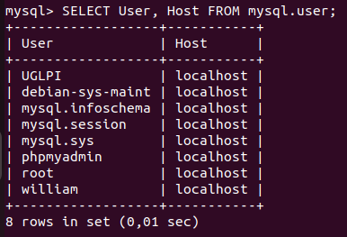

```bash
# Créer la base de données
create database sisr ;

# Utilisation de la base de données
use sisr ;

# Visualisation de la base de données
SHOW DATABASES;
```


```bash
# Création de la table : 

CREATE TABLE etudiants (
    numero INT NOT NULL PRIMARY KEY,
    nom VARCHAR(30),
    prenom VARCHAR(30),
    adresse VARCHAR(40),
    code_postal INT,
    ville VARCHAR(30),
    departement INT
);
```
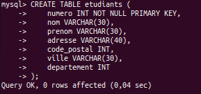

```bash
# Insertion en base de données : 
INSERT INTO etudiants (numero, nom, prenom, adresse, code_postal, ville, departement) VALUES
(1, 'Dupont', 'Pierre', '12 rue de Paris', 75001, 'Paris', 75),
(2, 'Martin', 'Marie', '34 avenue de la République', 69001, 'Lyon', 69),
(3, 'Durand', 'Paul', '56 boulevard Saint-Germain', 13001, 'Marseille', 13),
(4, 'Lemoine', 'Sophie', '78 rue du Faubourg', 31000, 'Toulouse', 31),
(5, 'Bertrand', 'Lucas', '90 chemin des Roches', 44000, 'Nantes', 44),
(6, 'Leclerc', 'Charlotte', '12 rue de la Liberté', 33000, 'Bordeaux', 33),
(7, 'Girard', 'Julien', '34 boulevard de la Gare', 59000, 'Lille', 59),
(8, 'Petit', 'Emma', '56 avenue du Général', 67000, 'Strasbourg', 67),
(9, 'Roux', 'Clément', '78 rue de la Paix', 75015, 'Paris', 75),
(10, 'David', 'Amandine', '90 avenue de la Mer', 13002, 'Marseille', 13),
(11, 'Muller', 'Benjamin', '12 rue du Parc', 69003, 'Lyon', 69),
(12, 'Simon', 'Laura', '34 rue de la Tour', 35000, 'Rennes', 35),
(13, 'Faure', 'Maxime', '56 rue du Mont', 92000, 'Nanterre', 92),
(14, 'Benoit', 'Isabelle', '78 boulevard de la Lune', 44000, 'Nantes', 44),
(15, 'Pires', 'Antoine', '90 rue de la Gare', 13003, 'Marseille', 13),
(16, 'Lemoine', 'Alice', '12 avenue des Champs', 21000, 'Dijon', 21),
(17, 'Chauvin', 'Arthur', '34 rue des Lilas', 75020, 'Paris', 75),
(18, 'Henry', 'Lucie', '56 rue du Parc', 13006, 'Marseille', 13),
(19, 'Blanc', 'Romain', '78 avenue de Verdun', 80000, 'Amiens', 80),
(20, 'Dufresne', 'Cécile', '90 rue des Prés', 44000, 'Nantes', 44);
```

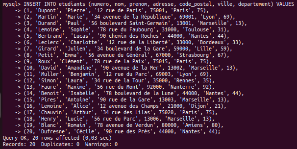

## 10 Requêtes

```bash
# Cette requête sélectionne toutes les colonnes de la table étudiants
SELECT * FROM etudiants;
```

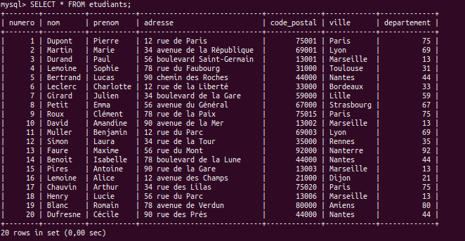

```bash
# Cette requête sélectionne les colonnes nom et prenom de la table étudiants.
SELECT nom, prenom FROM etudiants;
```

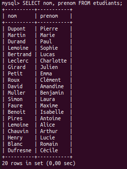

```bash
# Cette requête sélectionne tous les étudiants qui vivent en Paris.
SELECT * FROM etudiants WHERE ville = 'Paris';
```

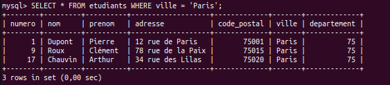

```bash
# Cette requête sélectionne tous les étudiants qui vivent dans un code postal dont le numéro est supérieur à 90000.
SELECT * FROM etudiants WHERE code_postal > 90000;
```

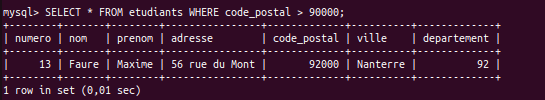


```bash
# Cette requête sélectionne les départements distincts (sans doublon) de la table étudiants.
SELECT DISTINCT departement FROM etudiants;
```

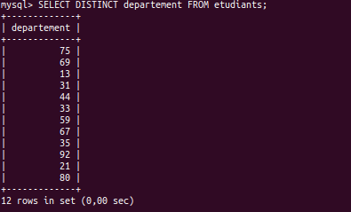


```bash
# Cette requête sélectionne tous les étudiants et les trie par nom de manière descendante (DESC).
SELECT * FROM etudiants ORDER BY nom DESC;
```

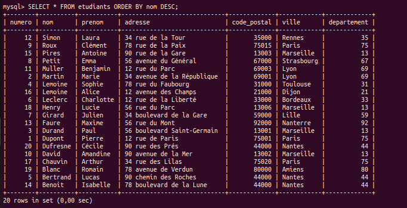


```bash
# Cette requête sélectionne les 5 premiers étudiants dans la table étudiants.
SELECT * FROM etudiants LIMIT 5;
```

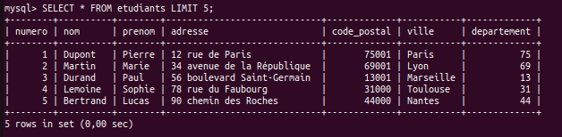

```bash
# Cette requête sélectionne les étudiants dont le nom commence "B%".
SELECT * FROM etudiants WHERE nom LIKE 'B%';
```

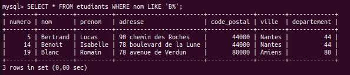


```bash
# Cette requête sélectionne les étudiants dont le département est 95 et le prénom est Clément.
SELECT * FROM etudiants WHERE departement = 75 AND prenom = 'Clément';
```

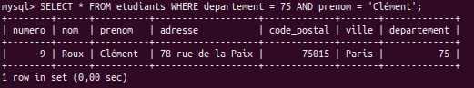

```bash
# Cette requête sélectionne tous les étudiants qui viennent soit du département 75 soit du département 93.
SELECT * FROM etudiants WHERE departement = 75 OR departement = 93;
```

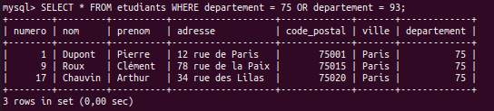


## Accéder à la base de données depuis PHPMYADMIN

Aller dans le navigateur http://localhost/phpmyadmin ou http://adresseIP/phpmyadmin

Puis rentrer l'identifiant et le mot de passe.

On accède ainsi à l'interface de PHPMYADMIN

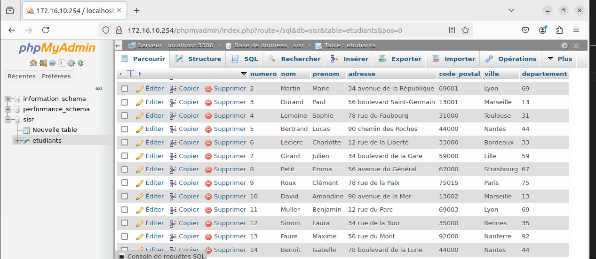